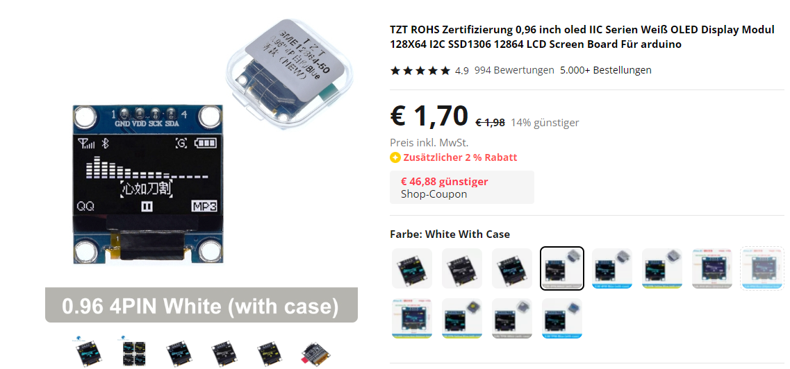
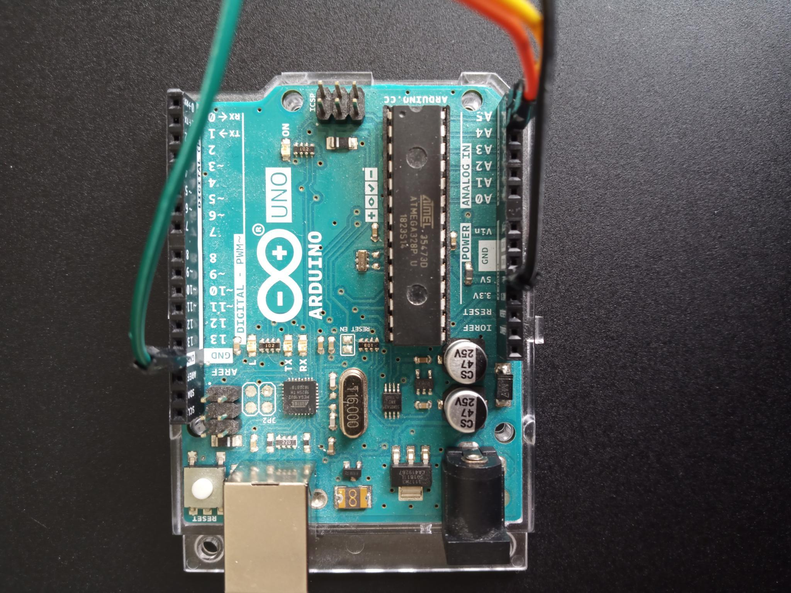
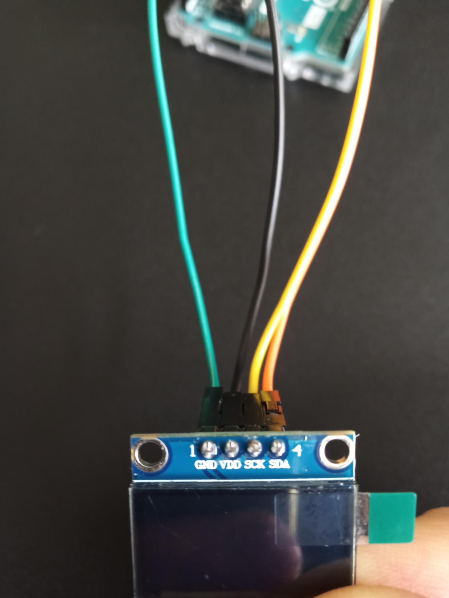
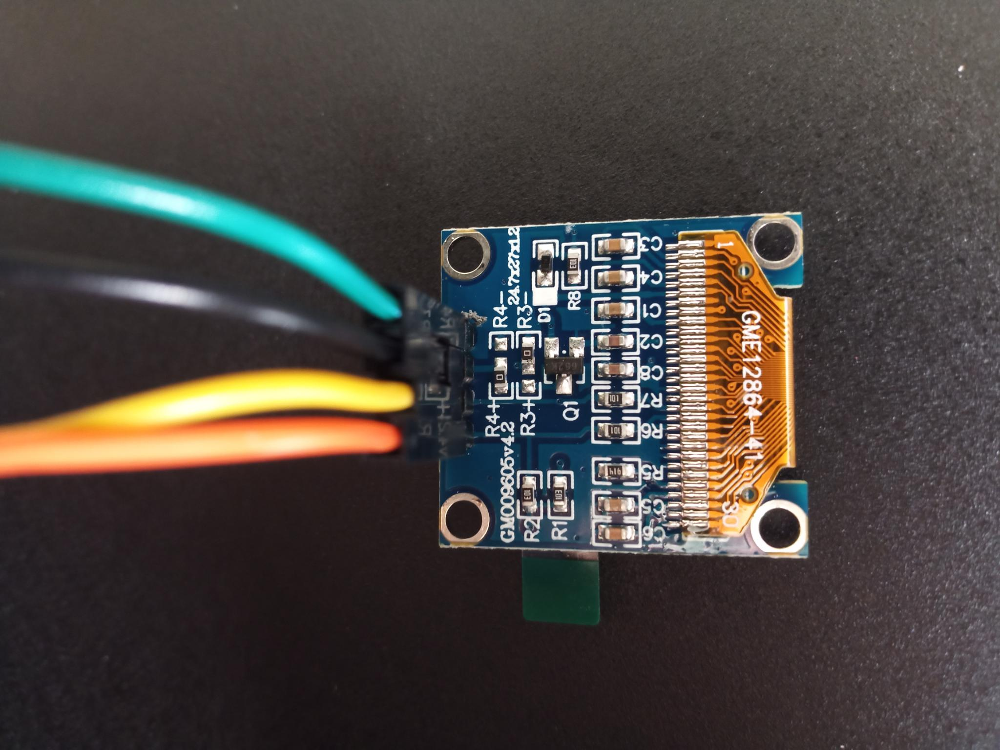

# Display Test Sketch
##### Display Typ:  OLED
##### Driver IC:   SSD1315 > same as SSD1306 from U8G2 library
##### Size: 0.96"
##### Operating voltage: 3,3V-5V
##### Resolution: 128 x 64 Pixel
Buy at Aliexpress: https://de.aliexpress.com/item/32896971385.html?spm=a2g0o.order_list.order_list_main.5.45425c5fXp6gyc&gatewayAdapt=glo2deu
#


#### Connection marking:
##### GND = Ground
##### VDD = Operating voltage 3,3-5V
##### SCK = I²C Clock > Ardunino UNO A5
##### SDA = I²C Daten > Ardunino UNO A4
#
### Connection Arduino UNO

#
### Connection Display

#
### Display from back

#
## Arduino IDE 2 Sketch for Displaytest
#
##### Download library **"U8g2"** from oliver
#
#### Create Sketch:

```c++
#include <Arduino.h>
#include <U8g2lib.h>

#ifdef U8X8_HAVE_HW_SPI
#include <SPI.h>
#endif
#ifdef U8X8_HAVE_HW_I2C
#include <Wire.h>
#endif


U8G2_SSD1306_128X64_NONAME_F_HW_I2C u8g2(U8G2_R0, /* clock=*/ SCL, /* data=*/ SDA, /* reset=*/ U8X8_PIN_NONE);  // High speed I2C

// U8G2_SSD1306_128X64_NONAME_F_SW_I2C u8g2(U8G2_R0, /* clock=*/ SCL, /* data=*/ SDA, /* reset=*/ U8X8_PIN_NONE);    //Low spped I2C

void setup(void) {
  u8g2.begin();
}

void loop(void) {
  u8g2.clearBuffer();                   // clear the internal memory
  u8g2.setFont(u8g2_font_ncenB08_tr);   // choose a suitable font
  u8g2.drawStr(0,10,"Hello World!");    // write something to the internal memory
  u8g2.sendBuffer();                    // transfer internal memory to the display
  delay(1000);  
}

```
Quelle: https://wiki.seeedstudio.com/Grove-OLED-Display-0.96-SSD1315/

 **Load Sketch to Arduino, Display says "Hello World".**

 # Ready :-)


